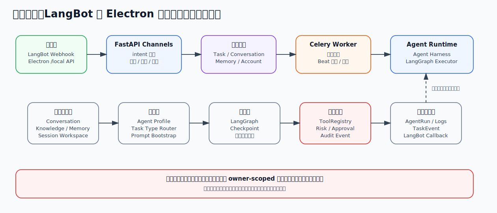
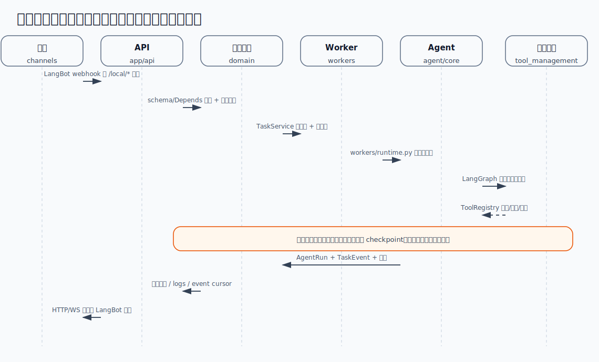
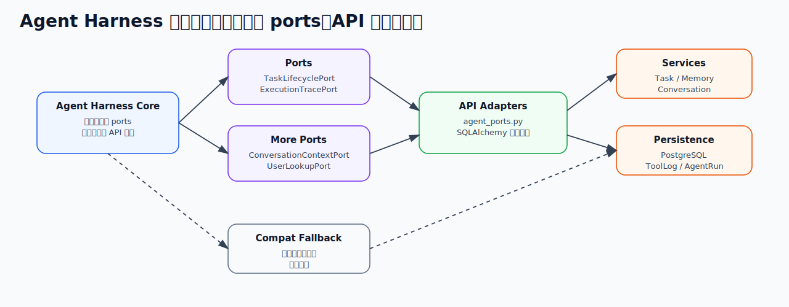
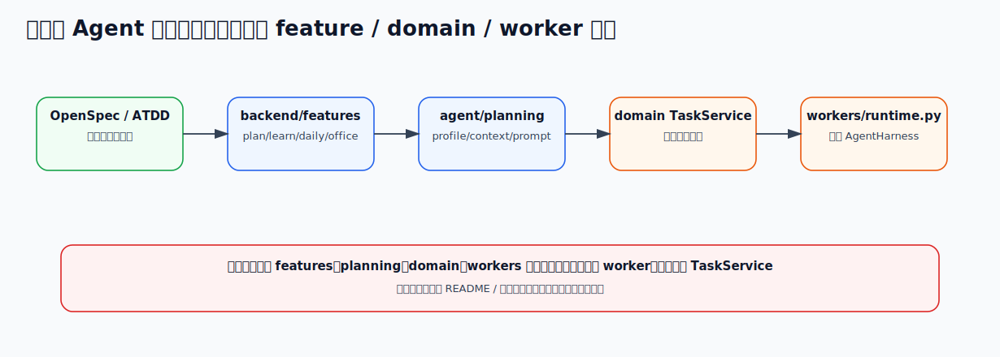
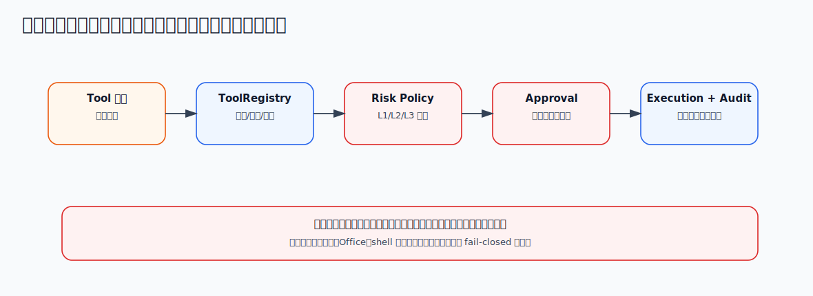

# assistant

个人 Agent 助手系统后端。这个项目的目标不是做一个“简单聊天机器人”，而是做一个**可长期演进、可控、可审计、可接入个人工具链的本机 Agent 助手系统**。

当前产品入口状态：

- **LangBot**：主消息入口和结果回推通道。
- **LangBot 意图路由**：进入任务系统前先做结构化 intent 判定，核心四意图直达任务，`needs_confirmation` 和 `needs_new_capability` 走无任务分支。
- **远程桥接账本**：`/api/remote-control/bridge/sessions` 记录 LangBot 入站、任务绑定、回推状态和重放信息，可供 Electron 读取。
- **本地 Agent API**：V7 新桌面端契约，提供 `/local/*` 任务、事件、审批和配置接口，供后续 Electron 桌面端使用。
- **Electron Web 桌面端**：V7 新桌面主线，当前已具备安全隔离工程骨架、三栏任务控制台、任务/事件/审批摘要、运行日志、审批/只读 diff、远程桥接会话视图和验证式设置源码。
- **Legacy Python 桌面源码**：历史 Qt GUI 源码保留在仓库中用于参考和旧测试，不再作为当前安装或启动入口。

阶段状态索引：

- **MVP 阶段 09**：真实 LangBot 通过 `POST /api/webhooks/langbot` 接入；Docker Compose 使用 `celery-worker` 和 `workers.worker:celery_app` 跑后台任务；`/learn` 通过 `search.web` 检索，`/daily` 通过 `search.web` 获取日常信息，`/office` 默认不执行搜索。
- **V2-03 在 V2-02 规划层上**接入执行层；`ToolRegistry`、MCP Server、LangGraph 保持受控边界，高风险能力默认不启用。
- **V2-04**：Celery Beat 负责维护扫描，`TaskService` 保持单实例任务入口；维护逻辑只处理 `waiting_approval`、超时 `running` 任务失败、`pending` 任务补偿和 `access_count`，不会自动修改用户数据。
- **V2-05 评测与回归阶段**：`run_evaluation.py`、`core_commands.json`、`v2-05.json` 用于回归，不替代真实端到端验收。
- **V3-08 已移除 Deepeval**，评测继续使用仓库内轻量数据集和 pytest。
- **V6-00**：`run_memory_baseline.py` 生成 `adaptive_memory_v6_00.json` 基线；自适应记忆策略仍标记为尚未上线。
- 后续外部能力边界：完整 MCP Gateway、深度浏览、真实 Office 文件生成、邮件/日历接入都必须经过工具治理、审批和验收测试。
- 搜索配置使用 `TAVILY_BASE_URL` 和 `TAVILY_API_KEY`；质量命令保留 `uv run pytest`、`uv run ruff check .`、`uv run mypy .`。

后端由 FastAPI、PostgreSQL、Redis、Celery 和 LangGraph Agent Runtime 组成。所有模型任务统一进入受控 LangGraph 执行层，工具调用经过 ToolRegistry、风险等级、审批和审计约束。

## 项目介绍

本项目解决的是个人日常 Agent 使用中的几个核心问题：

1. **入口统一**：LangBot 和桌面端都进入同一套任务系统，不让不同入口各自散落调用模型。
2. **执行可控**：模型不能随意调用工具，所有工具必须经过 ToolRegistry、allowed tools、risk level、版本和审批控制。
3. **过程可追踪**：任务状态、事件流、模型日志、工具日志、AgentRun 生命周期都会持久化。
4. **人机协同**：高风险工具、计划确认、结果复核支持人工审批，审批后可从 LangGraph checkpoint 恢复。
5. **个人上下文沉淀**：知识库、显式记忆、候选记忆、会话压缩和混合召回让 Agent 能逐步个性化。
6. **本机优先和安全边界**：账号连接加密保存，真实 SMTP/CalDAV/browser provider 在缺少配置时 fail-closed，不伪造成功。

一句话概括：

> 这是一个以任务为中心、以 LangGraph 为执行核心、以 ToolRegistry 为安全边界、以 Memory/Knowledge 为长期上下文的个人 Agent 后端。

## 四个核心功能

当前项目主要围绕四个核心 Agent 能力展开：

LangBot 入口会先做结构化 intent 判定：显式 `/plan`、`/learn`、`/daily`、`/office` 直达对应任务；`/memory` 和 `/status` 仍作为独立工具命令处理；自由文本会先归入四个核心意图、人工确认或新增能力三类之一，再决定是否创建任务。

### 1. `/plan`：计划与任务拆解

用于把用户目标拆成可执行计划，并在需要时进入计划审批或人工复核。

典型用途：

- 分解一个复杂任务。
- 生成执行步骤。
- 判断需要哪些工具。
- 高风险步骤先等待用户确认。

特点：

- 使用 Agent Profile 选择规划行为。
- Planning Layer 生成结构化执行计划。
- 可触发 `plan_approval` 和 `review_approval`。
- 执行过程写入 TaskEvent、ToolLog、AgentRun。

### 2. `/learn`：学习与资料理解

用于围绕问题或资料进行搜索、阅读、总结和知识沉淀。

典型用途：

- 搜索某个技术主题。
- 结合个人知识库回答问题。
- 从资料中提炼要点。
- 将有价值内容形成候选记忆。

特点：

- 可使用 `search.web`。
- 可接入个人知识库检索。
- 可结合长期记忆、会话摘要和 Memory blocks。
- 输出可被后续评估、记忆候选和回归测试覆盖。

### 3. `/daily`：日常助理与个人事务

用于处理日常信息、提醒、状态查询和个人事务类任务。

典型用途：

- 整理每日事项。
- 创建提醒。
- 查询近期任务状态。
- 结合记忆给出个性化建议。

特点：

- 和 Reminder / Notification outbox 打通。
- 支持桌面通知 poll / ack。
- 能读取本地任务状态和个人上下文。
- 保持本机私有化和 owner-scoped 访问。

### 4. `/office`：办公内容生成与工具调用

用于处理邮件、日历、文档、表格、浏览器等办公场景。

典型用途：

- 起草邮件或办公内容。
- 生成结构化材料。
- 查询或创建日历事件。
- 使用浏览器读取网页内容。
- 在需要时通过受控工具执行个人操作。

特点：

- 工具调用受 ToolRegistry 控制。
- SMTP、CalDAV、browser 等 provider 需要真实账号连接。
- 高风险工具需要审批。
- 工具输入输出写入审计日志，并做敏感信息脱敏。

## 技术栈

### 后端

- Python 3.12
- FastAPI
- SQLAlchemy Async ORM
- Alembic
- PostgreSQL
- Redis
- Celery worker / Celery Beat
- Pydantic Settings
- httpx

### Agent / AI

- LangGraph
- LangGraph PostgreSQL checkpoint saver
- Agent Profile
- Planning Layer
- ToolRegistry
- Capability Registry
- DeepSeek 兼容模型网关
- Tavily 搜索
- 可选 Mem0 语义记忆适配
- Langfuse / Prometheus / Sentry 观测边界

### 桌面端

- V7 新主线：Electron Web 桌面端，源码在 `frontend/desktop`
- 本地通信：`/local/*` HTTP API + WebSocket 事件流
- Legacy Python 桌面源码：历史 Qt GUI 代码仍保留，但当前依赖契约不再声明旧 Qt 安装入口

### 测试与质量

- pytest
- pytest-asyncio
- pytest-cov
- ruff
- mypy
- GitHub Actions CI
- Docker Compose smoke
- provider smoke
- 离线评测与 Memory release gate

## 项目目录

```text
.
├── backend/                         # 后端工程边界
│   ├── app/                          # FastAPI 应用壳
│   │   ├── api/routers/              # 普通 HTTP APIRouter 模块
│   │   ├── api/schemas/              # request / response DTO
│   │   ├── api/router.py             # router 汇总和 `/health`
│   │   ├── dependencies.py           # FastAPI Depends 入口
│   │   ├── support/                  # errors、commands、stream decoder 等小型支撑模块
│   │   └── main.py                   # create_app、lifespan、应用组装
│   ├── channels/                     # 协议通道适配
│   │   ├── langbot/                  # LangBot webhook、消息解析、结果回推
│   │   └── desktop/                  # `/local/*`、WebSocket 事件流、审批桥接
│   ├── domain/                       # SQLAlchemy models、业务服务、任务生命周期
│   ├── infrastructure/               # config、database、auth、logging、observability
│   ├── agent/                        # Agent 核心
│   │   ├── core/                     # runner、LangGraph executor、loop、subagents
│   │   ├── governance/               # routing 和 governed evolution
│   │   ├── memory/                   # 记忆安全、召回、候选、consolidation、release
│   │   ├── modeling/                 # agent model request/response 和 executor contract
│   │   ├── planning/                 # profiles、planner、context、capability snapshot
│   │   ├── review/                   # LLM Judge 与质量抽样
│   │   ├── skill_management/         # Skill loader、managed store、lifecycle
│   │   ├── tool_management/          # 工具目录、注册、搜索、浏览器、个人工具、沙箱
│   │   └── ports.py                  # Agent 依赖端口
│   ├── capabilities/                 # Capability Registry
│   ├── evaluation/                   # 离线评测与发布门禁
│   ├── features/                     # 四个核心 Agent 场景和未来场景的扩展入口
│   │   ├── plan/                     # task_type=plan，计划和任务拆解
│   │   ├── learn/                    # task_type=learn，学习、搜索、知识理解
│   │   ├── daily/                    # task_type=daily，提醒、状态、日常助理
│   │   └── office/                   # task_type=office，邮件、日历、浏览器、办公动作
│   ├── integrations/                 # 账号、凭据、SMTP/CalDAV/browser provider
│   ├── knowledge/                    # 知识库导入、解析、检索
│   ├── model_gateway/                # 模型网关、模型池、脱敏
│   ├── notifications/                # 提醒、通知 outbox、投递租约
│   ├── observability/                # 观测抽象
│   ├── resources/                    # 运行时资源
│   │   ├── prompts/                  # prompt 模板
│   │   └── skillpacks/               # 内置 Skill 包，每个目录包含 SKILL.md
│   ├── migrations/versions/          # Alembic 迁移
│   ├── config/                       # 后端示例配置
│   ├── scheduler/                    # 定时维护、监控和心跳入口
│   └── workers/                      # Celery app 和后台任务入口
├── frontend/
│   └── desktop/                      # V7 Electron + Vite + React 桌面端源码
├── legacy/
│   └── desktop-qt/                   # 历史 Qt 桌面端源码，当前不再声明安装入口
├── docs/                            # 方案、MVP/V2/V3/V4/V5/V6 文档
├── scripts/                         # 运维、评测、smoke 脚本
├── tests/                           # acceptance / evals / integration / unit
├── docker-compose.yml
├── Dockerfile
├── alembic.ini
├── pyproject.toml
└── uv.lock
```

## 项目架构

### 整体架构



### 任务执行时序



### Agent Harness 解耦边界



当前生产 worker 路径通过 `agent_ports.py` 注入实现，`compat.py` 只作为未注入 ports 时的旧调用兼容层。

## 项目主要功能

### 四个核心 Agent 场景

| 命令 | 目标 | 典型能力 |
|---|---|---|
| `/plan` | 计划与任务拆解 | 目标理解、步骤拆分、计划审批、复核恢复 |
| `/learn` | 学习与资料理解 | 搜索、知识库检索、总结、候选记忆 |
| `/daily` | 日常助理 | 提醒、状态、个人上下文、日常建议 |
| `/office` | 办公处理 | 邮件、日历、浏览器、文档内容、受控工具调用 |

### 支撑能力

- **任务系统**：任务创建、提交、列表、详情、状态流转。
- **审批系统**：工具审批、计划审批、人工复核，审批后可恢复执行。
- **事件系统**：任务事件持久化，支持事件流续读和终态退出。
- **AgentRun**：记录每次 worker 执行尝试，便于审计和排障。
- **模型网关**：统一 DeepSeek 兼容模型调用、脱敏、模型日志和模型池。
- **工具系统**：ToolRegistry 统一管理工具 schema、版本、风险、审批、并行安全。
- **记忆系统**：显式记忆、候选记忆、短期/长期记忆、混合召回、consolidation、policy rollout/rollback。
- **知识库**：文件上传、解析、分块、去重、搜索。
- **账号连接**：加密保存账号凭据，支持 SMTP、CalDAV、browser provider。
- **提醒通知**：提醒创建、取消、通知 outbox、桌面 poll/ack、LangBot 投递。
- **本地桌面契约**：`/local/*` 支持任务创建、任务快照、事件游标、WebSocket 事件流、日志和审批决策。
- **Electron 控制台**：三栏任务队列、活动线程和检查器，支持任务/事件/审批摘要、继续对话、运行日志、工具审批、文件引用、只读 diff、命令输出、空态和设置验证。
- **Legacy 桌面源码**：历史 Qt GUI 代码仍保留用于参考和旧测试，但当前安装、启动和依赖说明以 Electron 桌面端为准。

## 后续如何扩展新功能

这个项目的优势是：新增能力不需要直接把逻辑塞进 worker 或模型提示词，而是沿着固定扩展点演进。

### 扩展一个新的 Agent 场景

例如在 `/plan`、`/learn`、`/daily`、`/office` 之外新增 `/travel`：



建议步骤：

1. 先创建 `backend/features/<task_type>/README.md`，写清用户场景、边界和验收行为。
2. 在 `backend/features/<task_type>/definition.py` 声明 command、task type、profile、默认 skill 和允许工具。
3. 如需要调整 LangBot 意图分流或命令解析入口，改 `backend/app/support/commands.py` 和 `backend/channels/langbot/intent.py`。
4. 如需要调整 profile 适配逻辑，改 `backend/agent/planning/profiles.py`。
5. 共享工具放在 `backend/agent/tool_management`。
6. 如需要新的 prompt 模板，放到 `backend/resources/prompts`。
7. 如需要新的 Skill 包，放到 `backend/resources/skillpacks/<skill_name>/SKILL.md`。
8. 如需要新外部 provider，放到 `backend/integrations`。
9. 补 `tests/acceptance`，覆盖用户可见行为。
10. 更新 README 或对应 docs。

### 扩展一个新工具



新工具必须明确：

- 工具名
- 输入 schema
- 风险等级
- 是否需要审批
- 是否可并行
- 是否记录自己的日志
- 失败时如何脱敏

### 扩展一个新外部账号能力

例如新增一个新的邮件、日历或文档 provider：

1. 在 `backend/integrations` 中实现 provider。
2. 通过 `AccountConnectionService` 加密保存凭据。
3. 在工具层暴露受控动作。
4. 在 ToolRegistry 中设置风险等级和审批策略。
5. 补 provider smoke 或集成测试。

### 扩展一组新 API

新增 API 时优先按领域创建新的 router 模块，不要继续膨胀 `backend/app/api/router.py`。

推荐结构：

```text
backend/app/api/routers/new_feature.py
backend/app/api/schemas/new_feature.py
backend/new_feature/
tests/acceptance/test_new_feature.py
```

### Agent Harness 分层约定

- 场景运行时默认配置在 `backend/features/<task_type>/definition.py`，`backend/agent/planning/profiles.py` 只负责把 feature definition 适配成 AgentProfile；当前保留 `v2.planner`、`v2.researcher` 等 profile 名称。
- 规划层负责把任务拆成受控步骤，执行层只按 plan 和 allowed tools 调用边界能力。
- LangBot 通道代码在 `backend/channels/langbot`，桌面本地 `/local/*` 和 WebSocket 事件流代码在 `backend/channels/desktop`。
- 内置 Skills 从 `backend/resources/skillpacks/*/SKILL.md` 读取；新增 Skill 或工具声明后不会自动启用，必须经过 profile、工具目录和验收测试显式接入。

## 项目优势

### 1. 不是简单聊天，而是任务化 Agent 系统

所有入口都落到 Task，任务有状态、有事件、有 AgentRun、有日志，可以排查、恢复和审计。

### 2. 模型和工具之间有安全边界

模型不能直接执行任意动作。工具必须通过 ToolRegistry，受 allowed tools、risk level、approval、version、source availability 控制。

### 3. 支持人工审批和 checkpoint 恢复

高风险工具、计划和复核可以中断等待用户确认，确认后通过 LangGraph checkpoint 恢复，而不是重跑或丢上下文。

### 4. 个人上下文是长期资产

知识库、记忆、会话压缩、候选记忆、混合召回和 policy rollout 让系统能逐步沉淀个人偏好和事实，而不只是单轮问答。

### 5. 本机优先，敏感能力 fail-closed

账号、浏览器、邮件、日历等能力默认不伪造成功；缺少密钥或账号配置时直接 fail-closed，避免误导用户。

### 6. 高内聚、低耦合方向明确

API 路由已按领域拆分，Agent Harness 通过 ports 依赖抽象，API 层提供适配器，后续新增能力可以走固定扩展点。

### 7. 测试和质量门禁完整

当前有 acceptance、integration、evals、unit 测试，配合 ruff、mypy、coverage、CI 和 smoke，适合持续演进。

## 如何部署启动

更完整的配置说明见 [`docs/mvp-startup-config.md`](docs/mvp-startup-config.md)。如果想从桌面端按钮一路追到后端 API、服务函数和 Agent 执行层，见 [`docs/frontend-backend-flow.md`](docs/frontend-backend-flow.md)。

### 1. 准备环境

Python 版本由 `.python-version` 固定为 3.12，依赖使用 `uv` 管理。

```bash
uv sync
```

核心后端默认不安装 Playwright、Office 解析/生成和观测 SDK。按能力安装可选依赖：

```bash
uv sync --extra browser-automation
uv sync --extra office
uv sync --extra observability
```

常用组合示例：

```bash
uv sync --extra office --extra browser-automation
```

复制示例配置：

```bash
cp .env.example .env
```

至少需要填写：

```text
LOCAL_API_TOKEN=
CREDENTIAL_MASTER_KEY=
DATABASE_URL=
REDIS_URL=
```

按需配置外部能力：

```text
LANGBOT_WEBHOOK_SECRET=
LANGBOT_API_BASE_URL=
LANGBOT_API_KEY=
DEEPSEEK_API_KEY=
DEEPSEEK_BASE_URL=
TAVILY_API_KEY=
SMTP / CALDAV / Browser / Langfuse / Sentry 等配置
```

`.env`、Token、Cookie、API Key、私有 URL 不提交仓库。

### 2. Docker Compose 启动后端

```bash
docker compose up --build -d
```

Compose 中的 `migrate` 一次性服务会在 API、worker、Beat 启动前执行：

```bash
alembic upgrade head
```

API 默认映射到：

```text
127.0.0.1:8000
```

健康检查：

```bash
curl http://127.0.0.1:8000/health
```

### 3. 本地分进程启动

如果不使用 Compose，可以分别启动 API、worker、Beat。

先运行数据库迁移：

```bash
uv run alembic upgrade head
```

启动 API：

```bash
uv run uvicorn --app-dir backend app.main:app --reload
```

启动 Celery worker：

```bash
PYTHONPATH=backend:. uv run celery -A workers.worker:celery_app worker --loglevel=INFO
```

启动单实例 Beat：

```bash
PYTHONPATH=backend:. uv run celery -A workers.worker:celery_app beat --loglevel=INFO
```

### 4. 启动 Electron 桌面端

V7 的新桌面主线是 Electron Web 桌面端。当前工程位于 `frontend/desktop`，开发模式需要先安装 Node 依赖，并确保 Python API 已按前文启动。

```bash
cd frontend/desktop
npm ci
npm run dev
```

当前 Electron 源码覆盖：

- 主窗口、菜单、托盘占位和安全隔离基线。
- 本地 API 连接状态、API 地址和用户设置。
- 三栏任务控制台：任务队列、活动线程和检查器。
- 任务数量、运行中任务、待审批任务、已完成任务、事件数和变更数摘要。
- 任务详情、继续对话、WebSocket 事件流恢复、空态和刷新入口。
- 运行日志、审批面板、审批原因、风险等级、文件引用、只读 diff、命令输出和验证式设置保存。

### 5. 打包 Electron 桌面端

V7-06 采用 **external installed mode**：Electron 安装包只包含桌面壳和 Web UI，不内置 Python runtime、`.venv`、PostgreSQL、Redis、Playwright、Office 依赖、历史 Qt 桌面依赖或本地模型。用户需要单独启动 Python Agent Server。

```bash
cd frontend/desktop
npm ci
npm run build
npm run dist:dir
```

生成平台安装包：

```bash
npm run dist
```

发布边界检查：

```bash
uv run python scripts/ops/desktop_web_release_check.py
```

打包配置见 `frontend/desktop/electron-builder.json`，发布记录见 `frontend/desktop/RELEASE.md`。当前尚未在本工作区实际生成安装包，因此包体、冷启动耗时和空闲内存仍记录为 `not measured`，不能声明生产自动更新或跨平台签名已完成。

### 6. 常用验证命令

```bash
uv run pytest
uv run pytest --cov
uv run ruff check .
uv run mypy .
uv lock --check
uv run python scripts/ops/desktop_web_release_check.py
```

可选 smoke：

```bash
uv run python -m scripts.ops.compose_smoke
uv run python -m scripts.ops.provider_smoke
```

注意：部分集成测试会绑定本地 `127.0.0.1` 临时端口；在受限 sandbox 中运行可能需要放开本地端口绑定权限。
