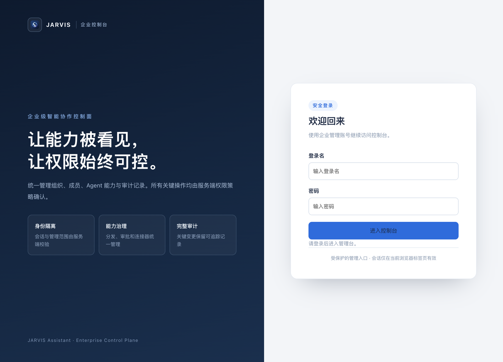
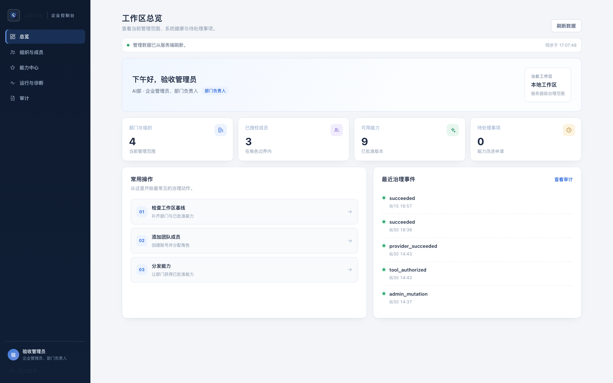
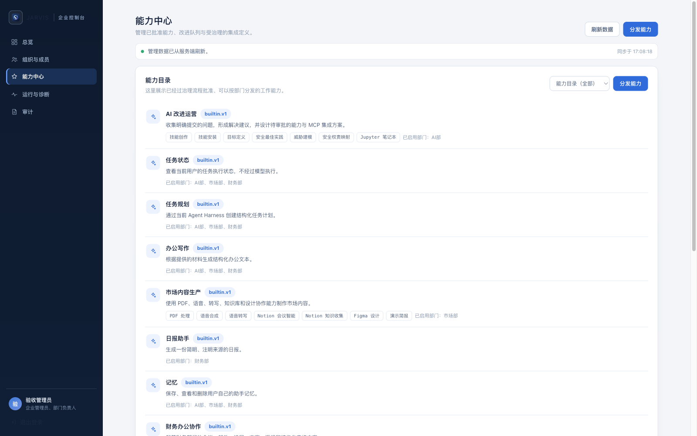
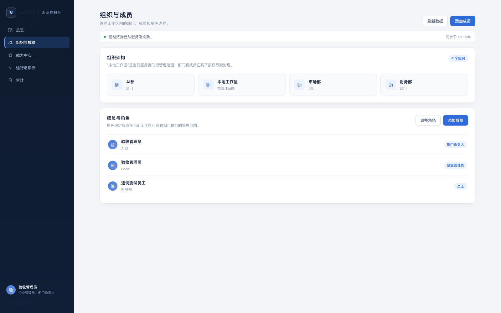
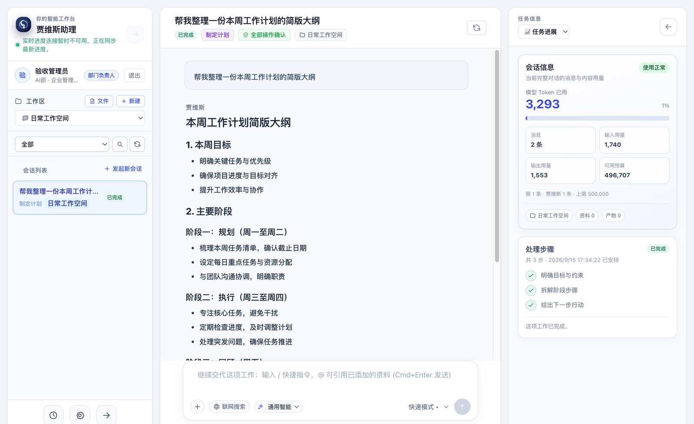
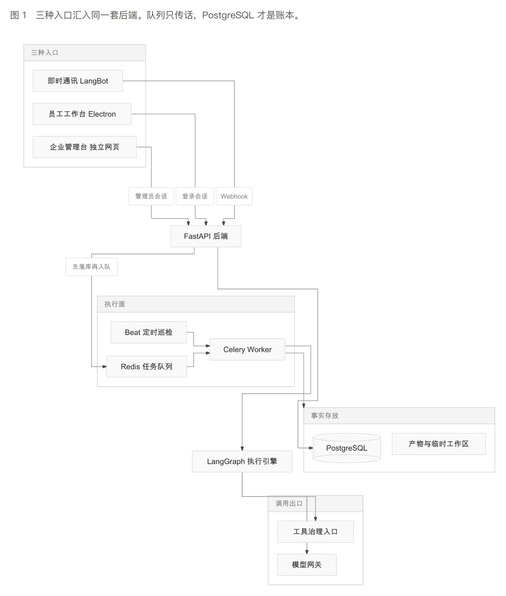
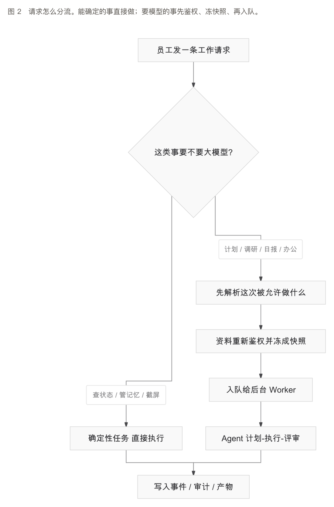
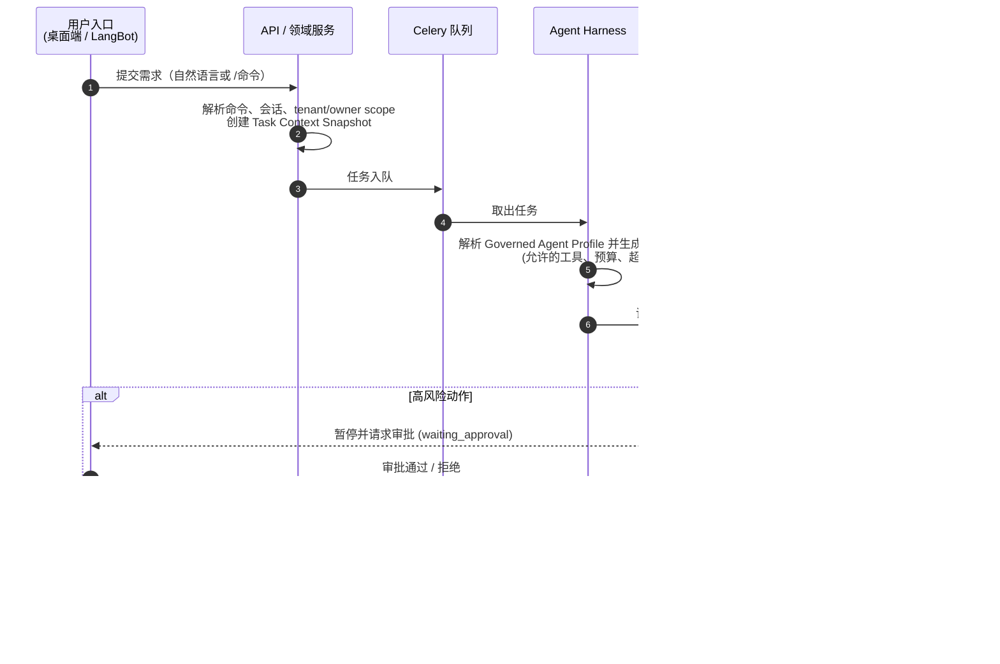
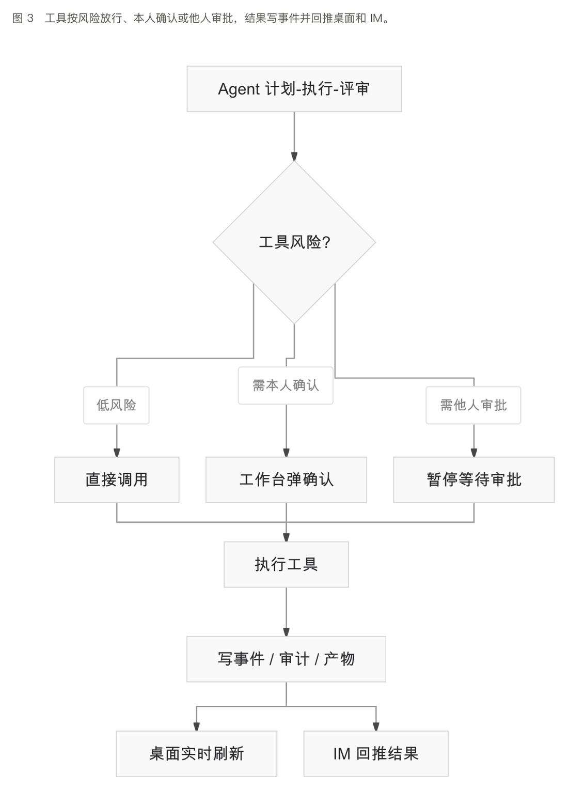
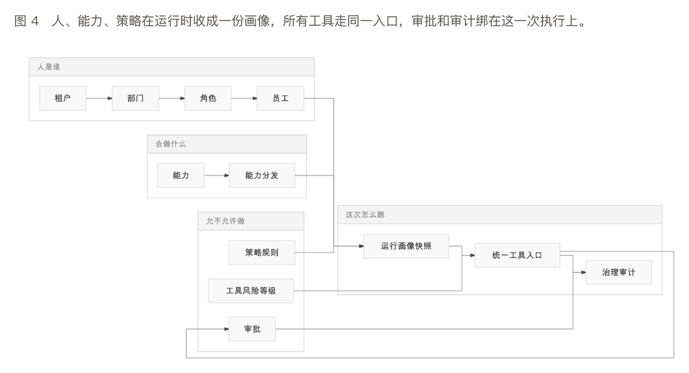

# assistant

可长期演进、可控、可审计的企业 Work Agent 系统与企业统一管理控制面。系统以 FastAPI 后端为核心，统一接收 LangBot 消息入口和 Electron 桌面端请求，将用户需求转成可追踪的任务、会话、事件、审批和运行日志；所有工具调用经过 ToolRegistry、风险分级、审批、审计和 owner-scoped 边界。

## 设计愿景

`assistant` 的目标不是做一个"完成一次问答的聊天机器人"，而是让员工获得一个自然工作的统一助手，同时让组织能够管理它**会什么、能看什么、能做什么、什么时候必须暂停并请求审批**。

为此项目坚持四条产品原则：

1. **统一助手体验**：员工只看到一个"我的工作助手"。Excel、CRM、报告等差异通过 Capability（能力）表达，Skill / MCP / Connector / Prompt / 模型供应商等技术概念不出现在员工界面。
2. **能力与权限分离**：Capability 表示"会做什么"，Policy 表示"是否允许做"。能力分发只提供候选，不构成最终执行授权。
3. **服务端是治理权威**：客户端只提交意图并展示结果，不直接连接外部系统，也不保存可绕过后端使用的企业凭证。每次执行前都基于当前主体、资源和风险重新鉴权，不使用过期授权。
4. **可审计**：审批是后端执行资格的一部分，不是前端弹窗；审计能回答谁、在什么上下文、请求了什么能力、命中什么策略、是否获批、最终执行结果。

详细业务语境与决策原因见 [`docs/knowledge.md`](docs/knowledge.md)。

## 产品界面

### 企业管理台（Web）

管理台是企业管理员的独立浏览器控制面（远程部署后通过 `:4173` 访问），统一管理组织、成员、能力分发、审批与审计。



登录后进入工作区总览：部门与组织数量、已授权成员、可用能力、待处理事项和最近治理事件一目了然。



能力中心展示全部经过治理批准的能力目录，按部门查看分发状态，并支持一键分发能力给部门。



组织与成员页管理部门、成员与角色边界；角色决定成员在当前工作区可查看和可执行的管理范围。



### 员工桌面工作台（Electron）

员工在桌面端完成登录后，按部门获得对应能力。新建工作区、发起会话、选择协助能力（制定计划 / 调研学习 / 生成日报 / 办公写作）即可开始协作。

下图为一次真实对话：员工请求"整理一份本周工作计划的简版大纲"，选择"制定计划"能力，贾维斯生成结构化大纲；右侧任务信息面板实时展示处理步骤（明确目标 → 拆解阶段步骤 → 给出下一步行动）与会话 token 用量（3,293 / 500,000，输入 1,740 / 输出 1,553）。



## 系统架构

三种入口（LangBot 消息、Electron 员工工作台、企业管理台）汇入同一套 FastAPI 后端：队列只传话，PostgreSQL 才是账本。



请求进入后按"要不要大模型"分流：查状态、管记忆、截屏等确定性动作直接执行；计划、调研、日报、办公写作先鉴权、冻结资源快照，再入队给 Worker 跑 Agent 计划-执行-评审。



一次 Agent 任务的完整执行链路如下。每一步都落在服务端：入口只提交意图，模型不能修改执行计划，工具执行前必须再次通过治理裁决。


```mermaid
sequenceDiagram
    autonumber
    participant U as 用户入口<br/>(桌面端 / LangBot)
    participant API as API / 领域服务
    participant Q as Celery 队列
    participant A as Agent Harness
    participant G as ToolRegistry 治理
    participant M as 模型 / 工具

    U->>API: 提交需求（自然语言或 /命令）
    API->>API: 解析命令、会话、tenant/owner scope<br/>创建 Task Context Snapshot
    API->>Q: 任务入队
    Q->>A: 取出任务
    A->>A: 解析 Governed Agent Profile 并生成 ExecutionPlan<br/>(允许的工具、预算、超时)
    A->>G: 请求调用工具
    G->>G: 复核能力、策略、风险、审批状态
    alt 高风险动作
        G-->>U: 暂停并请求审批 (waiting_approval)
        U->>G: 审批通过 / 拒绝
    end
    G->>M: 放行执行 (allow)
    M-->>G: 结果脱敏后返回
    A-->>U: 事件流 + 最终结果回推，写入审计
```

工具调用按风险分级放行：低风险直接调用，需本人确认的在工作台弹确认，需他人审批的暂停等待；结果写事件并回推桌面端与 IM。



人、能力、策略在运行时收成一份 Governed Agent Profile 快照，所有工具走同一治理入口，审批和审计绑在这一次执行上。



## 核心功能

以下状态以当前源码、测试和验收文档为准。历史阶段资料见 [`reference/`](reference/README.md)。

### 已实现

| 功能 | 说明 |
|---|---|
| 任务化 Agent | `/plan` 制定计划、`/learn` 调研学习、`/daily` 生成日报、`/office` 办公写作四类 Agent 任务，以及 `/memory`、`/status`、`/screen` 工具型命令；支持续写、事件流、日志和结果回推。 |
| 受控工具调用 | 工具统一在 ToolRegistry 注册并按风险等级执行；高风险动作进入 `waiting_approval`，审批绑定精确 task/run、参数指纹和权限修订，执行前复核；工具调用与结论写入治理审计。 |
| 本地账户与会话 | 邀请制账号，由管理员创建分发；密码使用版本化 scrypt 校验，服务端会话可撤销。支持管理员一次性应急恢复（`ADMIN_RECOVERY_*`），恢复凭据成功后自动消费并撤销旧会话。 |
| 企业治理基础 | 任务执行前解析 tenant/organization/role、Capability Grant、Policy 和资源范围，保存 Governed Agent Profile 快照；工具执行时再次复核权限修订。 |
| 员工桌面工作台 | Electron 三栏任务控制台：会话、任务、文件、产物、审批、我的能力；会话由主进程安全保存，renderer 不接触原始凭据。产物下载走主进程哈希缓存（500MB 上限，LRU 淘汰）。 |
| 企业管理 Web 控制台 | 独立浏览器管理台（`admin.html`，远程部署后通过 `:4173` 访问）：组织架构、成员与角色、能力目录与分发、审批、审计、能力改进队列、治理工具。 |
| 部门与能力分发 | 首次初始化幂等建立 AI 部、财务部、技术部及演示能力；部门获得的能力带标签目录、风险等级和绑定工具；市场 Skill 默认 `candidate_disabled`，审核后才可分发。 |
| 员工能力申请 | 员工在"我的能力"中向 AI 部提交需求并查看进度；申请只进入 tenant-scoped 改进队列，不会直接授予能力，发布必须由 AI 部负责人确认，全程写治理审计。 |
| 部门节点与受控运维 | 部门节点用一次性注册码接入，可撤销凭证上报心跳、拉取确定性能力配置；授权 IT 可做脱敏跨部门诊断和白名单远程操作（刷新/同步/暂停/停止/重启 Agent），不提供任意 Shell。 |
| 会话上下文与产物 | Conversation Context Composer（`@` Mention、受管上传、Artifact 引用）、按需 Execution Workspace、带 tenant/owner/hash/生命周期的持久 Artifact，下载与状态变更重新鉴权并写审计。 |
| 会话预算 | 每个会话累计 500,000 tokens（含所有 Task、AgentRun 与 SubAgent 的输入输出），不同任务类型有差异化超时与输入/输出包络；桌面端展示真实用量与剩余额度。 |
| Space 协作基础 | tenant-scoped Space 与 owner/editor/viewer 成员关系；成员可协作分组，但不能读取他人私有会话，也不会继承工具、凭据或审批权限。 |
| 内容治理 | `search.web` 来源经 Content Guard 后才进入模型历史；出站回答脱敏，`/learn` 必须引用保留来源；开启治理时不推送未校验的流式增量。 |
| 记忆与知识 | conversation、knowledge、agentic memory 多层记忆；PostgreSQL 生产环境启用 tenant/org RLS，语义检索先构造 governed filter 再召回，不支持时 fail closed。 |
| 远程桥接账本 | LangBot 入站消息、任务绑定、回推状态和重放信息记录在 bridge sessions；`/screen` 复用原会话回传截图。 |
| 隧道化联调 | `scripts/tunnel.sh` 把远程 API 映射到本地端口，带心跳保活与健康探测，桌面端指向隧道端口联调远程后端。 |

### 部分实现（有明确边界）

| 功能 | 已有 | 未做 |
|---|---|---|
| 搜索 Provider Chain | Tavily → Serper → Exa 依次尝试，未配置 Key 的 provider 跳过，失败信息脱敏。 | 未配置真实 Key 时无可用的真实联网搜索；深度浏览未启用。 |
| Office 生成 | 远程 Worker 按任务生成文档、表格、演示文稿 Artifact。 | 不编辑既有 Office 文件，不发送或同步外部邮件/日历账户。 |
| Connector / MCP | 管理台可登记候选 Connector 定义，通过 review/risk/binding 后进入受治理 Provider Gateway。 | 真实企业系统连接、凭证轮换与外部系统同步仍是后续受治理阶段。 |
| 内容治理 Provider | 默认 `local` 确定性规则，无网络依赖；可选 `guardrails_ai` 试点适配器。 | 不启用远程 validator；OPA/Rego、policy-as-code 为明确延后项。 |
| 观测与评估 | 可选 `observability` extra，只发送脱敏有界的关联信息与用量摘要，默认关闭。 | 外部观测不替代本地审计、确定性评测与人工审查。 |
| 截图能力 | `controller_http` 模式对接受信任截图 controller，产物登记 TTL 生命周期。 | 容器不假装拥有宿主机 GUI 权限，controller 不可达时安全失败。 |

### 未实现 / 明确延后

- 真实企业系统（CRM/ERP/邮件/日历）的读写 Connector 与凭证管理。
- Space 级资源分享、Artifact 分享与外部发布。
- Space / organization 级 Artifact 可见性（当前只有 `private` 与 owner-scoped `conversation`）。
- 浏览器自动化（默认不安装 `browser-automation` extra，`BROWSER_ENABLED=false`）。
- 独立 policy-as-code 服务（Microsoft Agent Governance Toolkit、OPA/Rego）。
- IT 部与示例账号：初始化只建立 AI 部、财务部、技术部。

## 技术栈

### 后端

- Python 3.12 / FastAPI / Uvicorn
- SQLAlchemy (async) / Alembic / PostgreSQL（生产环境含 tenant/org RLS）
- Redis / Celery / Celery Beat
- Pydantic Settings / structlog

### Agent 与工具治理

- LangGraph / Agent Harness（计划 → 执行 → 评审，支持 SubAgent 与权限交集收缩）
- ToolRegistry、风险分级、Approval、Governance Audit
- Governed Lifecycle Hook Registry：服务端受信来源注册 Observer / Guard，Guard 只能收紧 `before_*` 动作，不接受用户 import path 或 shell 命令
- 会话级 token 预算与按任务类型的差异化模型参数包络
- Session Workspace、Workspace Context、可选 Docker sandbox

### 桌面端与 Web 管理台

- Electron / React / TypeScript / Vite
- 主进程代理鉴权与产物缓存，renderer 不持有会话凭据
- Web 管理台复用同一 React 组件体系，经 nginx 容器独立部署

### 测试与质量

- 后端：pytest、ruff、mypy、覆盖率门禁、wheel 安装冒烟
- 桌面端：`tsc --noEmit` 类型检查与构建验证
- 精确命令见 [`rules/testing.md`](rules/testing.md)

## 快速启动

默认使用 Docker Compose 启动完整后端链路（PostgreSQL、Redis、迁移、API、Celery Worker 和 Beat）：

```bash
cp .env.example .env
cd backend && uv sync
cd ..
docker compose up --build
```

默认 API 只监听本机 `http://127.0.0.1:18080`，确认启动完成后检查：

```bash
curl -fsS http://127.0.0.1:18080/health
```

远程部署还会启动 Web 管理台，直接访问 `http://<服务器IP>:4173/`；它是独立浏览器页面，不依赖 Electron，API、数据库和现有数据卷保持不变。

启动 Electron 桌面端：

```bash
cd frontend/desktop
npm ci
npm run dev
```

本地 Electron 连接远程服务器时，不启动本地后端，而是通过 SSH 隧道把远程 API 映射到本地端口：

```bash
scripts/tunnel.sh start    # 启动（等待健康检查通过）
scripts/tunnel.sh status   # 查看状态（含远端健康探测）
scripts/tunnel.sh stop     # 停止
scripts/tunnel.sh restart  # 重启
```

脚本把本地 `18081` 映射到远程 `127.0.0.1:18080`，并带 10 秒心跳防止远程 sshd 掐断空闲连接。桌面端 Settings 中将 Local API URL 设为 `http://127.0.0.1:18081`。注意本地 `18080` 可能被其他项目占用，客户端一律使用 `18081`。

管理员无法登录时，可由运维临时配置 `ADMIN_RECOVERY_ENABLED`、`ADMIN_RECOVERY_QUESTION` 和对应的加盐 scrypt 校验值启用应急恢复；恢复成功后凭据自动消费、旧会话撤销，不要把恢复答案写入仓库或日志。

## 全量启动指南

### 1. 启动方式选择

| 方式 | 适用场景 | 推荐度 |
|---|---|---|
| Docker Compose 全链路 | 日常本地运行、桌面端联调、需要 Worker/Beat 的任务执行 | 推荐 |
| 宿主机分进程 | 调试 API、Worker 或断点；需要自行提供可访问的 PostgreSQL 和 Redis | 按需 |
| Electron 桌面端 | 使用本地任务控制台；依赖已经可访问的本地 API | 按需 |

默认的 Compose 服务是 `postgres`、`redis`、`runtime-init`、`migrate`、`assistant-api`、`celery-worker` 和 `celery-beat`；远程部署另含 `web-admin`。`ops` 服务属于 `ops` profile，不随默认链路启动。

### 2. 前置条件与本地配置

需要安装：Docker Desktop（或兼容的 Compose 环境）、Python/uv，以及使用桌面端时安装 Node.js/npm。请从仓库根目录执行命令。

```bash
cp .env.example .env
cd backend && uv sync
cd ..
```

`uv sync` 在 `backend/.venv` 创建后端环境。若本地缓存目录受限，使用：

```bash
cd backend && UV_CACHE_DIR=.uv-cache uv sync
```

可选依赖按需安装；远程演示镜像默认包含 `office`，但不包含浏览器自动化：

```bash
cd backend && uv sync --extra office
cd backend && uv sync --extra observability
cd backend && uv sync --extra content-governance
```

远程演示建议保持 `BROWSER_ENABLED=false`、`CELERY_WORKER_CONCURRENCY=1`；模型推理使用已配置的外部模型 API，不在 4 GB 服务器上运行本地大模型。

`.env` 只保存本机配置与真实凭据，绝不提交 Token、Cookie、API Key、认证头或私有 URL。模板中的外部模型、搜索和 LangBot 值是占位配置：基础服务可以启动，但不代表真实外部调用已经可用。

`backend/resources/` 是随源码发布的内置源资源（Prompt 和 Skill）；`backend/var/` 是可变运行时根目录。`backend/.venv`、`backend/.uv-cache` 和 `backend/var` 都是本地状态，不应纳入提交。

> **根目录工作目录约定：** `Settings` 使用相对 `.env` 文件。推荐从仓库根目录运行 `uv --project backend run ...`，这样会读取根目录的 `.env`。若改为 `cd backend && uv run ...`，Settings 会寻找 `backend/.env`，不会自动读取根目录的 `.env`。

### 3. Docker Compose：完整后端链路

#### 启动

```bash
docker compose config -q
docker compose up --build
```

若只需启动 API 及其 Compose 依赖而不启动 Worker/Beat：

```bash
docker compose up --build assistant-api
```

首次启动时，`runtime-init` 初始化运行时 volume 的可写目录；`migrate` 将 Alembic 迁移升级到 head；随后 API、Worker 和 Beat 才会启动。Worker/Beat 维护会将超时 `running` 任务失败，并执行延迟的 `pending` 任务补偿；阈值由 `RUNNING_TASK_TIMEOUT_SECONDS` 与 `PENDING_TASK_COMPENSATION_DELAY_SECONDS` 控制。API 映射为 `127.0.0.1:${ASSISTANT_API_HOST_PORT:-18080}`，容器内端口固定为 `8000`。

后台运行和查看状态：

```bash
docker compose up --build -d
docker compose ps
docker compose logs -f assistant-api celery-worker celery-beat
```

#### 就绪检查

默认端口是 `18080`；若你在 `.env` 修改了 `ASSISTANT_API_HOST_PORT`，请替换下列端口。

```bash
curl -fsS http://127.0.0.1:18080/health
curl -fsS http://127.0.0.1:18080/local/health
curl -fsS http://127.0.0.1:18080/local/config
```

`/health` 和 `/local/health` 都应返回 `status: "ok"`。`/local/config` 只返回非敏感的本地运行时能力摘要。LangBot 的入站 webhook 为 `POST /api/webhooks/langbot`；真实回调需要配置匹配的 webhook secret，不能使用占位值作为连通性证明。

#### 停止

```bash
docker compose down
```

除非明确需要删除本地数据库、任务产物和运行时状态，否则不要追加 `-v`。该操作会删除 Compose volumes，属于破坏性清理。

### 4. 宿主机分进程调试

仅在需要断点或单独调试 API/Worker/Beat 时使用。Compose 默认的 `DATABASE_URL` 和 `REDIS_URL` 使用 `postgres`、`redis` 这两个 Compose 网络别名；它们**不能**从宿主机 Python 进程直接解析。

开始前，请在根目录 `.env` 中把 `DATABASE_URL` 和 `REDIS_URL` 设置为你自己的、从宿主机可访问的 PostgreSQL 和 Redis 地址，并先完成迁移。

在三个独立终端、且均从仓库根目录运行：

```bash
# 终端 1：迁移（首次或 schema 更新后）
uv --project backend run alembic -c alembic.ini upgrade head

# 终端 1：API（开发热重载）
uv --project backend run uvicorn app.main:create_app --factory --reload --port 18080

# 终端 2：Worker
uv --project backend run celery -A workers.worker:celery_app worker --loglevel=INFO

# 终端 3：Beat
uv --project backend run celery -A workers.worker:celery_app beat --loglevel=INFO
```

如果只调试 HTTP 路由，可只启动 API；需要异步任务执行、补偿或周期性维护时必须同时启动 Worker，周期任务还需要 Beat。

### 5. 桌面端登录与初始化

在 API 已就绪后运行 `npm run dev`。桌面端 Settings 中配置：

- **Local API URL**：例如 `http://127.0.0.1:18080`（远程隧道模式为 `http://127.0.0.1:18081`）；主进程只接受 localhost 根地址，不允许携带路径、用户名或密码。
- **Workdir**：现有的本地目录；客户端会在保存前校验路径。

桌面端采用邀请制：账号一律由企业管理员在管理端创建并分发，登录页不提供自助注册入口。首次部署时由运维初始化企业管理员；系统会在同一事务中自动建立 AI 部、财务部、技术部及其演示能力，首位管理员同时成为 AI 部负责人。之后可在管理台查看 AI 改进队列、检查并补齐基线、创建成员和分发已批准能力。详细步骤见 [本地登录、部门与管理台启动](docs/local-startup.md)。

本机开发模板的 `LOCAL_API_AUTH_REQUIRED` 仍是可选的本地 API 传输边界；它不替代本地登录会话。Electron renderer 不保存原始会话或 Bearer 凭据，主进程只在对受限 localhost API 的请求中附加当前会话。

### 6. 可选能力与安全边界

#### 外部模型、搜索、LangBot

将真实凭据仅写入未提交的 `.env`。模型、搜索和 LangBot 适配器通过统一 Gateway/治理边界调用；真实 LangBot 回调还必须配置正确的 webhook secret 与 API 凭据。未配置时应保持可解释失败，不要以占位值当作真实连通性证明。

搜索 Provider 配置：

- `search.web` 默认按 `SEARCH_PROVIDER_ORDER=tavily,serper,exa` 尝试。
- Tavily 使用官方 `tavily-python` SDK：只需 `TAVILY_API_KEY`、`TAVILY_TIMEOUT_SECONDS` 和 `TAVILY_MAX_RESULTS`。
- Serper 使用 `SERPER_API_KEY` / `SERPER_BASE_URL`，Exa 使用 `EXA_API_KEY` / `EXA_BASE_URL`；未配置 Key 的 provider 会被跳过。
- 所有 provider 的失败信息会先脱敏，再进入任务结果或 `tool_logs`。

#### 浏览器、Office 与观测

远程演示默认安装 `office` extra 以支持文档、表格和演示文稿 Artifact；`browser-automation` 不安装且 `BROWSER_ENABLED=false`，需要时再单独启用。`observability` 仍按需安装。

#### 截图 controller

Docker 容器不能直接取得宿主机 GUI 权限。默认 controller 模式需要一个受信任、仅监听本机或受控网络的截图 controller：

```env
DESKTOP_CAPTURE_ENABLED=true
DESKTOP_CAPTURE_MODE=controller_http
DESKTOP_CAPTURE_CONTROLLER_URL=http://host.docker.internal:8765/screenshot
DESKTOP_CAPTURE_DEFAULT_TARGET=frontend
DESKTOP_CAPTURE_REQUIRE_CONFIRMATION_FOR_DESKTOP=true
DESKTOP_CAPTURE_ARTIFACT_TTL_SECONDS=3600
```

controller 不可达时 Worker 会安全失败并记录 `desktop_controller_unavailable`。非 Docker 调试可以在取得宿主机屏幕权限后使用 `local_process` 模式：

```bash
PYTHONPATH=. uv --project backend run python scripts/smoke/screenshot.py
```

### 7. 验证与发布前检查

从仓库根目录执行：

```bash
# 后端测试与覆盖率
PYTHONPATH=. uv --project backend run pytest
PYTHONPATH=. uv --project backend run pytest --cov

# Python 质量门禁
cd backend && uv run ruff check . ../tests
cd backend && uv run mypy
cd backend && uv lock --check
cd ..

# wheel 安装边界：构建、隔离安装，并导入 app.main 与 features.catalog
UV_CACHE_DIR=backend/.uv-cache uv --project backend run python scripts/smoke/wheel_install.py

# 桌面端
cd frontend/desktop
npm run typecheck
npm run build
```

外部服务、GUI 权限、端口绑定或真实 Provider 相关测试必须在支持其前置条件的环境运行。若某次完整测试未通过，应记录失败类别和环境限制，不要把环境限制误报为实现已经通过或失败。

### 8. 常见问题

| 现象 | 首先检查 |
|---|---|
| API 无法访问 | `docker compose ps`、`docker compose logs assistant-api migrate`、端口是否仍为 `18080`。 |
| Worker 不消费任务 | `docker compose logs celery-worker redis`；确认 Worker 与 API 使用同一 Redis 配置。 |
| 宿主机直启时报数据库/Redis 主机找不到 | `.env` 是否仍使用 Compose 的 `postgres` / `redis` 别名；改为宿主机可访问的地址。 |
| 桌面端无法连接或登录失败 | Local API URL 是否指向隧道端口（远程模式 `http://127.0.0.1:18081`，本地 Compose 模式 `http://127.0.0.1:18080`）、`scripts/tunnel.sh status` 是否健康、API `/local/health` 是否返回 `ok`。账号为邀请制，由管理员在管理端创建。 |
| `/screen` 安全失败 | controller 是否运行且可访问、屏幕权限是否授予、审批要求是否满足。 |
| `uv` 因缓存权限失败 | 在 `backend/` 下使用 `UV_CACHE_DIR=.uv-cache uv ...`；不要创建或提交其他嵌套缓存目录。 |

## 代码与文档导航

- 当前目录结构、文件位置、符号定义、调用链和影响范围以 CodeGraph 与源码为准，README 不维护平行代码地图。
- Agent 的执行约束见 [`AGENTS.md`](AGENTS.md) 和 [`rules/`](rules/README.md)。
- 稳定的业务、产品与领域知识见 [`docs/knowledge.md`](docs/knowledge.md)。
- 历史架构说明、实施记录、教程和旧方案见 [`reference/`](reference/README.md)，使用前必须结合当前源码、测试与 OpenSpec 判断准确性。
- 会改变用户可见行为、API、Agent 行为、配置、部署或运维结果的计划优先进入 OpenSpec。
